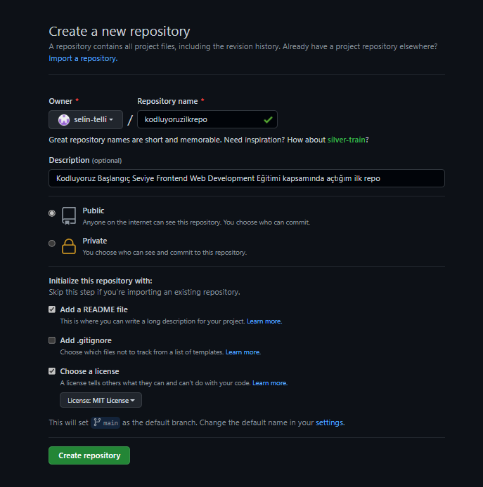

# kodluyoruz ilk repo

Kodluyoruz Başlangıç Seviye Frontend Web Development Eğitimi kapsamında açtığım ilk repodur.

Bu repo [Kodluyoruz](https://www.kodluyoruz.org/) Front-End Eğitiminde oluşturduğumuz ilk repo. İçerisinde bir adet README dosyası, bir adet de index.html barındırıyor.



## Installation

Öncelikle projeyi clonelayın. (Buraya sizin reponuzdan aldığınız link gelecek)

``` bash

git clone https://github.com/selin-telli/kodluyoruzilkrepo.git

```

## Usage

Projeyi cloneladıktan sonra Visual Studio Code programında açınız.

Linux için:

``` 

cd kodluyoruzilkrepo
code .

```
## Contributing

Pull requestler kabul edilir. Büyük değişiklikler için, lütfen önce neyi değiştirmek istediğinizi tartışmak için bir konu açınız.

## Licence

[MIT](https://choosealicense.com/licenses/mit/)


